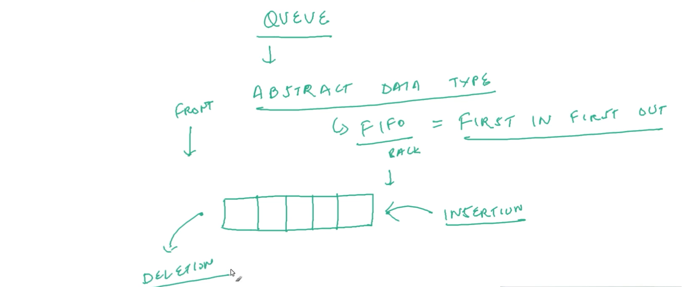
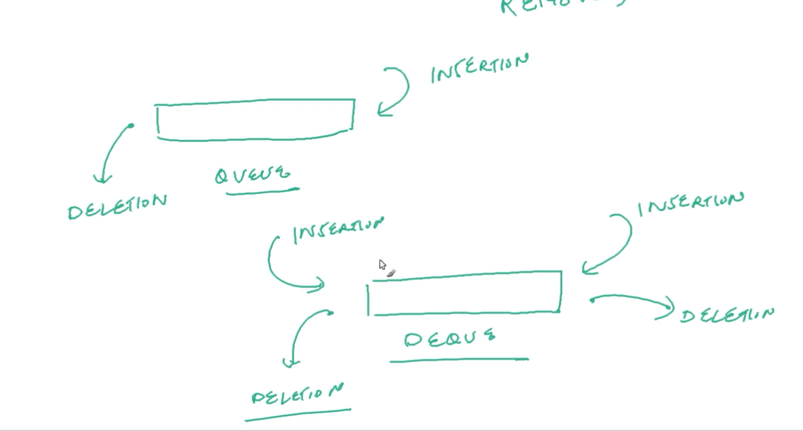
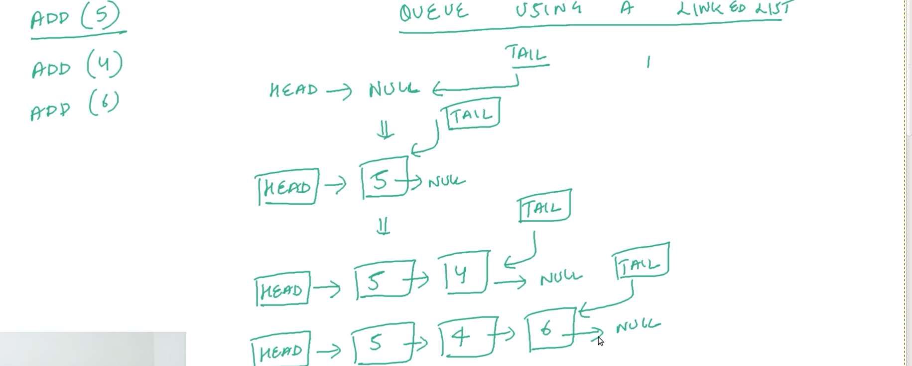
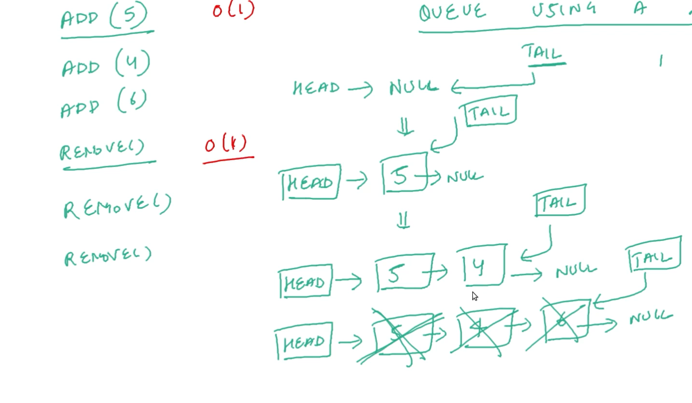

# QUEUE-DSA

| NO.|   Questions                                                                                                                                                                 |
| ---| ------------------------------------------------------------------------------------------------------------------------------------------------------------------------------------------------------------------------------------------------------|
|    | **Types of QUEUES**                                                                                                                                                         |
| 1 | [what-is-QUEUE](#)                                                                                                                                                           |
| 2 | [QUEUE-using-linked-list](#)                                                                                                                                                 |
| 3 | [QUEUE-implementation](#)                                                                                                                                                    |

|  1  | [what is QUEUE](#)  

 # 1.1 what is queue
 
  
  QUEUEs is also mentained as  'ADT': Abstract data types  

  
  It has the name called FIFO : FIRST IN FIRST OUT means Front end 

  
  process would be Delection at foront and Insertioin at the back end 

   
  

  # 1.2
  
  

  # 1.3
  
  

  | 2 | [queueusingLinkedlist](#)
  # 2.1
  

  # 2.2
  

  # 3
  
